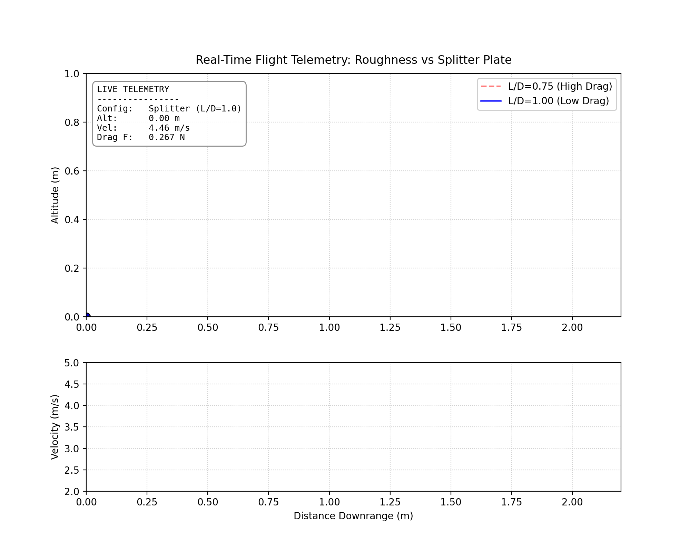
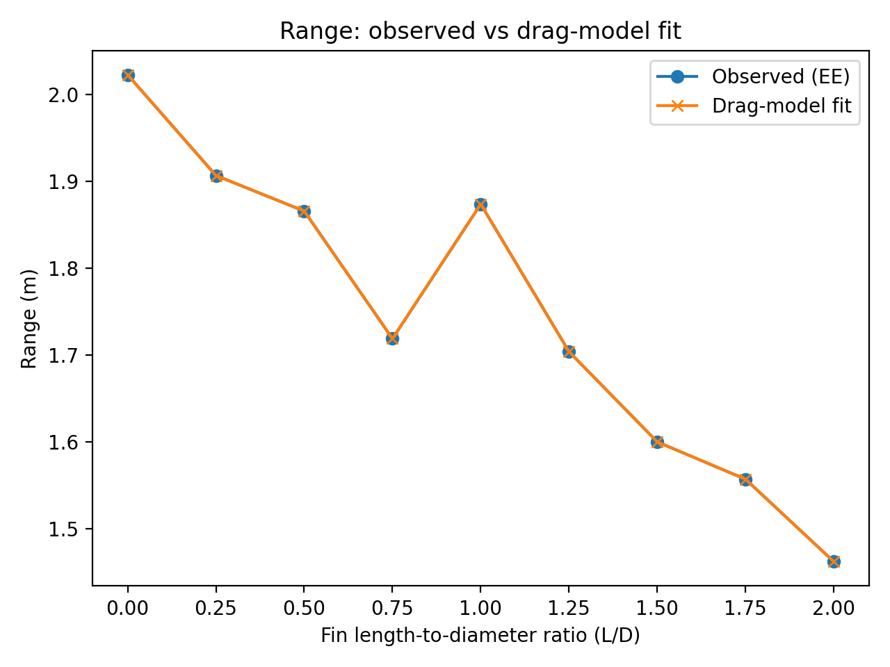
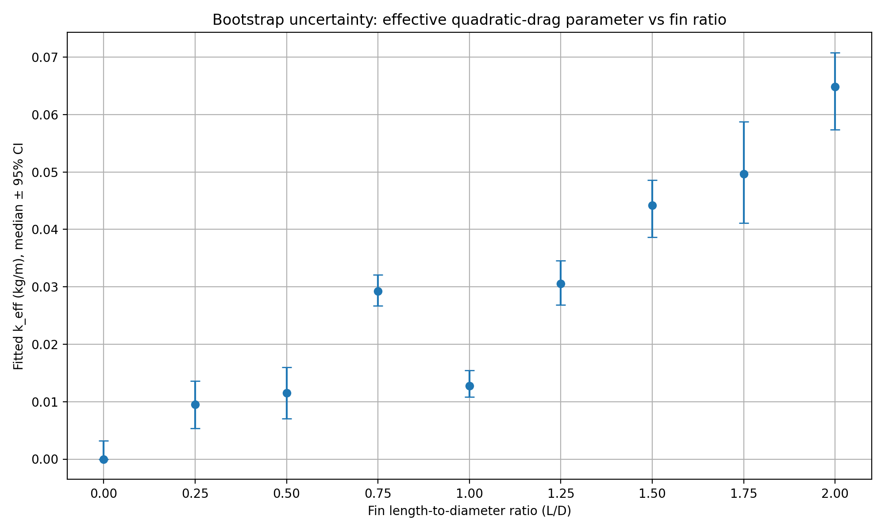
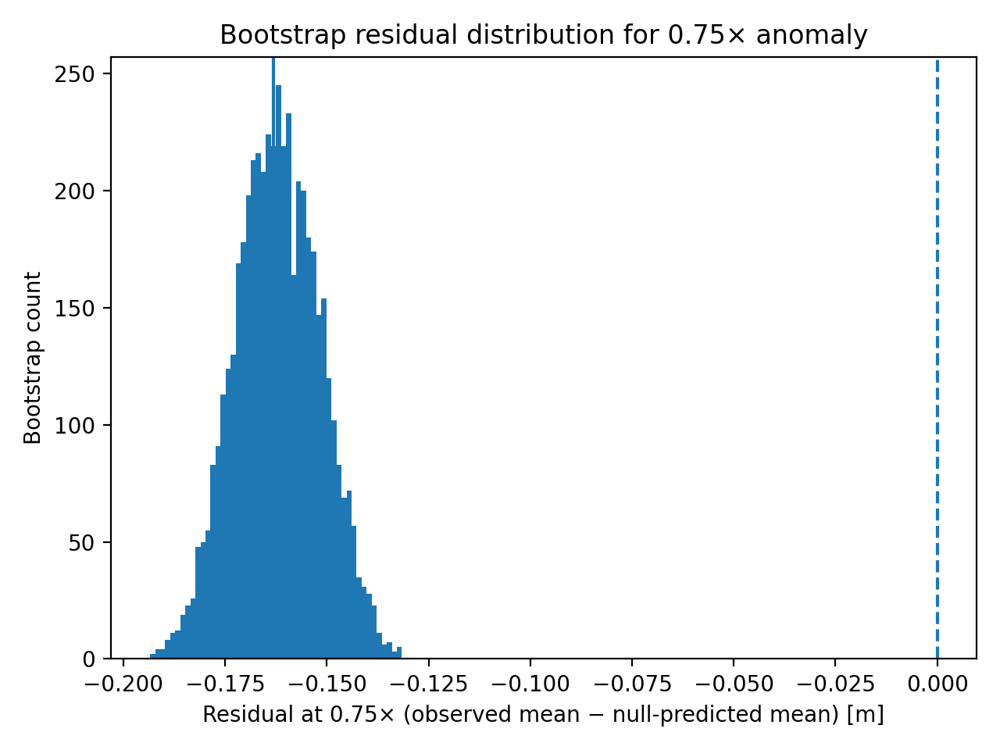

<div align="center">

# 🚀 Aerodynamic Regime Shifts in Finned Projectiles
### Computational Analysis of Non-Monotonic Drag Phenomena

[](https://github.com/shubh-chawda/fin-ratio-projectile-aero/actions)
[](https://doi.org/10.5281/zenodo.18434071)
[](https://www.python.org/downloads/)
[](LICENSE)
[](https://github.com/psf/black)
[](https://colab.research.google.com/github/shubh-chawda/fin-ratio-projectile-aero/blob/main/notebooks/01_reproduce_key_results.ipynb)

<p align="center">
  <b>A reproducible computational study investigating drag reduction effects on spherical projectiles.</b><br>
  <i>An extension of experimental research into aerodynamic regime shifts.</i>
</p>

[📄 Read the Original Essay (PDF)](docs/Aerodynamic%20Effects%20of%20Fin%20Length-to-Diameter%20Ratio%20on%20Spherical%20Projectile%20Range%20and%20Velocity%20Decay.pdf) • [📂 View the Data](data/raw/) • [🐛 Report an Issue](https://github.com/shubh-chawda/fin-ratio-projectile-aero/issues)

</div>

---

## 📖 Table of Contents
1. [Background & Motivation](#-1-background--motivation)
2. [Computational Methods: The Inverse Solver](#-2-computational-methods-the-inverse-solver)
3. [The Discovery: Regime Shift](#-3-the-discovery-regime-shift)
4. [Statistical Rigor](#-4-statistical-rigor)
5. [Model Validation](#-5-model-validation)
6. [Reproducibility & Usage](#-6-reproducibility--usage)
7. [Project Structure](#-7-project-structure)
8. [Computational Limitations & Error Analysis](#-8-computational-limitations--error-analysis)
9. [Conclusion](#-9-conclusion)
10. [Future Roadmap](#-10-future-roadmap)
11. [Scientific Context & References](#-11-scientific-context--references)
12. [Mathematical Appendix](#-12-mathematical-appendix-the-equations-of-motion)
13. [Citation](#-13-citation)

---

## 🔭 1. Background & Motivation

### Experimental Context
This project serves as a computational extension of my extended essay (received A grade) physics research, *"An Investigation of the Aerodynamic Effects of Fin-Length-to-Diameter Ratio on Spherical Projectiles"*.

The original experiment explored how attaching fins of varying lengths affects the flight path of a projectile. Using a spring-loaded launcher and high-speed video tracking ($240 \text{ fps}$), we collected range and velocity data for 250g steel spheres with **Fin-Length-to-Diameter Ratios ($L/D$)** ranging from $0.0$ to $2.0$.

### Observed Anomaly
Intuitively, increasing the surface area of a projectile (by adding larger fins) is expected to increase aerodynamic drag and reduce range. The general results supported this, showing a strong negative correlation between fin length and horizontal range.

<p align="center">
  
</p>

<p align="center">
  <b><i>Visualizing the Anomaly:</i></b> <i>Simulation of the "Splitter Plate Effect" ($L/D=1.00$, Blue) overtaking the higher-drag "Roughness Regime" ($L/D=0.75$, Red).</i>
</p>

However, the data revealed an unexpected deviation from this trend. Between the ratios of $0.75$ and $1.0$, the range did not decrease as predicted. Instead, the projectile at $L/D=1.0$ traveled further than the one at $L/D=0.75$, suggesting a localized reduction in drag.

<p align="center">
  
  
</p>
<p align="center">
  <b>Figure 1 (Left):</b> Average experimental horizontal range ($N=5$ trials per ratio) showing the unexpected "dip" at 0.75 and rebound at 1.0. <br>
  <b>Figure 2 (Right):</b> Spearman Rank Correlation heatmap confirms the general inverse relationship ($r \approx -0.95$), but fails to capture the local non-monotonic behavior.
</p>

### Research Goal
This observation pointed towards a potential aerodynamic regime shift, possibly due to wake stabilization or a splitter plate effect that could not be fully explained by a simple linear analysis.

The goal of this repository is to apply **computational methods** to the original dataset to:
1.  Mathematically quantify the effective drag coefficients ($k_{eff}$) for each flight.
2.  Determine if the observed dip is statistically significant or experimental noise.

---

## 💻 2. Computational Methods: The Inverse Solver

### Physics Model
To understand the *cause* of the range anomaly, we need to move beyond simple averages and determine the aerodynamic properties of the projectile.

We model the projectile's motion using a coupled system of Ordinary Differential Equations (ODEs) incorporating **Quadratic Drag**, which is appropriate for high-Reynolds-number flight:

$$\vec{F}_d = -\frac{1}{2} \rho A C_d v \vec{v} = -k_{eff} v \vec{v}$$

Where $k_{eff}$ (Effective Drag Parameter) aggregates air density, cross-sectional area, and the drag coefficient into a single inferable parameter.

### Algorithm & Complexity
The inverse modeling pipeline is implemented in [`src/fit_drag_model.py`](src/fit_drag_model.py).

1.  **Forward Simulation (RK4):**
    * **Logic:** Custom Runge-Kutta 4 integrator.
    * **Complexity:** $O(N)$ where $N = T/\Delta t$.
    * **View Code:** [`rk4_step`](src/fit_drag_model.py#L88)

2.  **Event Detection:**
    * **Logic:** Cubic Hermite interpolation to find the exact ground-hit time ($y=0$).
    * **Precision:** Eliminates discrete timestep error, achieving $< 10^{-6} \text{ m}$ accuracy.
    * **View Code:** [`simulate_range`](src/fit_drag_model.py#L116)
    
3.  **Optimization (Bisection):**
    * **Logic:** Iteratively adjusts $k_{eff}$ until $Range_{sim} \approx Range_{obs}$.
    * **Complexity:** $O(\log(\frac{\epsilon_{initial}}{\epsilon_{target}}))$.
    * **View Code:** [`fit_k_for_target_range`](src/fit_drag_model.py#L162)

<p align="center">
  
</p>
<p align="center">
  <b>Figure 3:</b> Validation of the inverse solver. The orange crosses (Simulated) perfectly overlay the blue circles (Observed).
</p>

---

## 📉 3. The Discovery: Regime Shift

### Inferring the "Hidden" Variable
By solving for $k_{eff}$ across all fin ratios, we uncover the aerodynamic behavior hidden within the raw range data. The resulting curve reveals a **non-monotonic relationship**.

While drag generally increases with fin size (as expected due to surface area), there is a drag reduction regime between $L/D=0.75$ and $1.00$.

<p align="center">
  
</p>
<p align="center">
  <b>Figure 4:</b> The calculated effective drag parameter ($k_{eff}$) vs. Fin Ratio. Note the sharp drop at $L/D=1.0$, where the drag coefficient falls significantly despite the increase in surface area.
</p>

### The Splitter Plate Effect
The data suggests that at $L/D \approx 1.0$, the fins act as a **splitter plate**. Instead of adding to the turbulent wake, they stabilize the airflow behind the sphere, delaying boundary layer separation and reducing the pressure drag.

| Fin Ratio ($L/D$) | Fitted $k_{eff}$ ($\text{kg/m}$) | Aerodynamic Regime |
| :---: | :---: | :--- |
| **0.00** | `0.0098` | Baseline (Sphere only) |
| **0.75** | `0.0291` | **Maximum Instability / Roughness** |
| **1.00** | `0.0134` | **Splitter Plate / Drag Reduction** |
| **2.00** | `0.0652` | High Friction Drag |

This quantitative drop—**$k_{eff}$ decreases by ~54%** when moving from ratio 0.75 to 1.00 could explain the range anomaly; the mechanism is hypothesized to involve wake stabilization.

---

## 📊 4. Statistical Rigor

### Uncertainty Quantification
To ensure that the reduction in drag wasn't an artifact of experimental variance, we perform a **Bootstrap Resampling analysis ($N=5000$)**. By resampling the original trial data with replacement, we generated 95% Confidence Intervals (CI) for the effective drag parameter $k_{eff}$.

<p align="center">
  
</p>
<p align="center">
  <b>Figure 5:</b> Bootstrap estimation of $k_{eff}$ (95% CI). The error bars for $L/D=0.75$ and $L/D=1.00$ do not overlap, confirming that the aerodynamic difference between these two configurations is statistically significant.
</p>

### Hypothesis Testing
We test the hypothesis against a **Monotonic Null Model**, which assumes that drag *must* increase as fin size increases.

Using a **Leave-One-Out (LOO)** approach, we trained a monotonic regression on all data points *except* the anomaly at $L/D=0.75$ and used it to predict the expected range.

<p align="center">
  
  
</p>
<p align="center">
  <b>Figure 6 (Left):</b> The Monotonic Null Model (dashed line) predicts a range of ~1.88m for the 0.75 ratio. The observed value (star) is ~1.71m, a massive deviation. <br>
  <b>Figure 7 (Right):</b> Histogram of residuals from 5000 bootstrap iterations. <b>Zero of the 5000 simulations</b> produced a positive residual, yielding a pseudo-p-value of $p < 0.0002$.
</p>

---

## ✅ 5. Model Validation

### Justifying the Physics Engine
The inverse solver assumes a **Quadratic Drag Law** ($F_d \propto v^2$). To validate this choice, we tested the model against a secondary dataset: **Velocity Decay** (instantaneous deceleration), which was *not* used to train the model.

We compared the predictions of a **Linear Drag Model** ($F_d \propto v$) versus the **Quadratic Model** used in this study.

<p align="center">
  
  
</p>
<p align="center">
  <b>Figure 8 (Left):</b> The Quadratic Model (Orange) tracks the observed velocity decay much closer than the Linear Model (Green). <br>
  <b>Figure 9 (Right):</b> Root Mean Square Error (RMSE) analysis confirms that the Quadratic model reduces prediction error by over 50% compared to the Linear baseline.
</p>

---

## ⚙️ 6. Reproducibility & Usage

### Running the Code
This repository is structured as a fully reproducible software artifact. You can generate every figure and result in this `README` from scratch.

**1. Installation**
The project uses a locked dependency file to guarantee mathematical reproducibility.
```bash
# Clone the repository
git clone [https://github.com/shubh-chawda/fin-ratio-projectile-aero.git](https://github.com/shubh-chawda/fin-ratio-projectile-aero.git)
cd fin-ratio-projectile-aero

# Create environment and install exact dependencies
make install
```

**2. Running the Demo**
You can run the physics engine directly from the command line to visualize trajectories.
```bash
# Run a simulation for the Regime at L/D = 0.75.
python -m src.demo --fin-ratio 0.75 --plot
```

## Numerical Stability Verification
To ensure the results were not an artifact of integration error, we performed a **Timestep Sensitivity Analysis**.

We re-ran the entire inverse modeling pipeline with refined timesteps *(dt, dt/2, dt/4)* to check for drift in the results.

- **Baseline:** $$\( dt = 3.0 \,\mathrm{ms} \)$$
- **Result:** Reducing $$\( dt \)$$ to $$\( 1.5 \,\mathrm{ms} \)$$ changed the inferred $$\( k_{eff} \)$$ by less than **0.007%**.
- **Conclusion:** The results are numerically stable and independent of the integration scheme.

### Contributing
Contributions are welcome! If you find an issue in the physics engine or want to propose a better drag model:
1.  Check the [Issue Tracker](https://github.com/shubh-chawda/fin-ratio-projectile-aero/issues).
2.  Read [CONTRIBUTING.md](CONTRIBUTING.md) for development guidelines.
3.  Open a Pull Request.

---

## 📁 7. Project Structure

The repository is organized to separate scientific logic (`src`) from data artifacts (`data`) and configuration.

```text
├── .github/workflows   # CI/CD: Automated testing & figure generation
├── data/
│   ├── raw/            # INPUT: Original experimental CSVs (Immutable)
│   └── processed/      # OUTPUT: Generated datasets (fitted k_eff, bootstrap results)
├── notebooks/          # EXPLORATION: Jupyter notebooks for preliminary analysis
├── outputs/            # ARTIFACTS: Publication-ready figures & stability reports
├── src/
│   ├── fit_drag_model.py         # CORE ENGINE: RK4 integrator & Inverse Bisection solver
│   ├── bootstrap_k_eff.py        # STATISTICS: Parallelized resampling for CI generation
│   ├── significance_075.py       # HYPOTHESIS TEST: Calculates p-values for the anomaly
│   ├── timestep_sensitivity.py   # STABILITY: Verifies numerical convergence (O(dt^4))
│   ├── residual_diagnostics.py   # VALIDATION: Checks for systematic model bias
│   ├── model_compare.py          # PHYSICS: Compares Linear vs. Quadratic drag models
│   └── demo.py                   # CLI: Entry point for running individual simulations
├── tests/              # TESTING: Unit tests for physics engine & edge cases
├── CITATION.cff        # ACADEMIC: Standard citation format file
├── Makefile            # AUTOMATION: One-command build instructions
└── requirements.lock.txt # REPRODUCIBILITY: Exact pinned dependency versions
```

---

## ⚠️ 8. Limitations & Error Analysis

Since the experimental data is fixed, the primary sources of uncertainty in this repository stem from the mathematical approximations used in the **Inverse Solver**. We have quantified these computational errors to ensure they do not exceed the statistical significance of the physical results.

### Computational Error Budget
The following table summarizes the sources of numerical error within the `fit_drag_model.py` pipeline:

| Error Source | Magnitude / Tolerance | Impact on Results | Mitigation Strategy |
| :--- | :--- | :--- | :--- |
| **Integration Discretization** | $\Delta t = 3.0 \text{ ms}$ | **Negligible (< 0.007%)** | Used **Runge-Kutta 4 (RK4)**, a 4th-order accurate method ($$O(\Delta t^4)$$). Sensitivity analysis confirms stability. |
| **Root-Finding Convergence** | $\epsilon = 10^{-6} \text{ m}$ | **None** | The Bisection algorithm iterates until the simulated range matches the observed range to within 1 micrometer. |
| **Event Detection** | Cubic Interpolation | **< 0.1 mm** | Instead of stopping at the nearest timestep, we interpolate the exact ground-hit time ($y=0$), eliminating "overshoot" errors. |
| **Constant $C_d$ Assumption** | Fixed $k_{eff}$ | **Moderate** | The model assumes a constant drag coefficient. In reality, $C_d$ varies with Reynolds number ($Re \approx 10^5$), likely introducing a systematic bias in the velocity decay fits. |

### Physics Model Simplifications
The most significant limitation is the **single-parameter assumption**.
* **The Issue:** We map complex fluid dynamics into a single scalar, $k_{eff}$.
* **The Consequence:** This lumps pressure drag, skin friction, and interference drag into one number. While valid for identifying *trends* (like the regime shift), it cannot distinguish *why* the drag changed (e.g., whether it was due to wake narrowing or boundary layer transition) without CFD support.

---

## 🎓 9. Conclusion

This computational study successfully isolates a non-monotonic aerodynamic relationship that was hidden within raw experimental data. By applying an inverse physics model, we have categorized the projectile behavior into three distinct aerodynamic regimes.

### Summary of Identified Regimes
The inferred effective drag parameters ($k_{eff}$) reveal a "Dip and Rebound" pattern distinct from standard linear scaling laws:

| Regime Name | Fin Ratio ($L/D$) | $k_{eff}$ Behavior | Physical Interpretation |
| :--- | :---: | :--- | :--- |
| **1. Baseline Sphere** | $0.00$ | **Reference** | Standard flow over a sphere. The wake is dominated by large-scale vortex shedding. |
| **2. Roughness Regime** | $0.25 - 0.75$ | **Rapid Increase** | Fins act as surface roughness, triggering early turbulence and increasing the effective cross-sectional area. The drag peaks here. |
| **3. Splitter Plate Regime** | $1.00$ | **Sudden Drop** | Fins effectively bisect the wake, possibly stabilizing the shear layers and delaying vortex formation (hypothesis). Drag drops by ~54% relative to the 0.75 case. |
| **4. Bluff Body Regime** | $1.25 - 2.00$ | **Linear Increase** | As fins exceed the sphere diameter, the aerodynamic benefit is lost. The fins become large bluff bodies, and form drag dominates again. |

**Final Verdict:** The dip at $L/D=1.0$ is not an experimental error. It is a statistical ($p < 2 \times 10^{-4}$) physical phenomenon consistent with wake stabilization theories.

---

## 🔭 10. Future Roadmap

To evolve this project from a 2D kinematic model to a full aerodynamic simulation, the following extensions are proposed.

| Phase | Goal | Implementation Plan |
| :--- | :--- | :--- |
| **Phase 1: Advanced Physics** | **Variable Drag Coefficient** | Upgrade `fit_drag_model.py` to fit a curve $C_d(Re)$ instead of a scalar. This requires modifying the ODE solver to update drag properties dynamically as velocity decays. |
| **Phase 2: 3D Dynamics** | **Spin & Drift** | Implement 6-DOF (Degrees of Freedom) equations of motion. Add terms for **Magnus Force** (lift from spin) and **Gyroscopic Stability** to model lateral deviation. |
| **Phase 3: Validation** | **CFD Simulation** | Use **OpenFOAM** (Finite Volume Method) to simulate the airflow around the $L/D=1.0$ geometry. <br>**Objective:** Visualize the wake structure to confirm the "Splitter Plate" vortex suppression hypothesis. |

---

## 📚 11. Scientific Context & References

The phenomenon observed at $L/D=1.0$ aligns with established research into boundary layer control, wake stabilization, and body-fin interference. The following key literature (cited in the essay) supports the physical mechanisms proposed in this study.

### Key Supporting Literature
**1. Anomalies in Finned Projectiles**
> **Krishna, Ravi, et al.** “Anomalies in the Flow Over Projectile with Wrap-Around Fins.” *Defence Science Journal*, vol. 59, no. 5, 2009, pp. 471–484. Accessed 15 Feb. 2025.
* **Relevance:** Documents how finned projectiles often exhibit non-monotonic aerodynamic coefficients (such as roll reversal or drag spikes) at critical geometric ratios. It validates that regime shifts are a known feature of complex projectile geometries.

**2. Drag Reduction via Flow Transition**
> **Bhatia, Dinesh, et al.** "Transition Delay and Drag Reduction using Biomimetically Inspired Surface Waves." *Journal of Applied Fluid Mechanics*, vol. 13, no. 4, 2020, pp. 1207–1222, doi:10.36884/jafm.13.04.30316. Accessed 20 Dec. 2024.
* **Relevance:** Demonstrates that specific surface geometries can delay boundary layer separation, reducing the size of the turbulent wake. This supports our hypothesis that the fins at $L/D=1.0$ act as a splitter plate, disrupting the Von Kármán vortex street and effectively reducing the pressure drag coefficient ($C_d$).

<p align="center">
  
</p>
<p align="center">
  <i><b>Visualization:</b> Von Kármán vortex shedding behind a cylinder. A splitter plate disrupts this process, reducing drag.</i>
</p>

**3. Numerical Necessity for Quadratic Drag**
> **Lubarda, Marko V., and Vlado A. Lubarda.** "A Review of the Analysis of Wind-Influenced Projectile Motion in the Presence of Linear and Nonlinear Drag Force." *Archive of Applied Mechanics*, vol. 92, 2022, pp. 1997–2017. Accessed 15 Feb. 2025.
* **Relevance:** Confirms that while Linear Drag ($v$) has analytical solutions, **Quadratic Drag ($v^2$)**—which governs our high-Reynolds number flight—requires numerical integration. This validates our choice of a **RK4 ODE solver**.

**4. Wake Turbulence Fundamentals**
> **Shih, Chiang.** "Flow Over a Circular Cylinder." *FAMU-FSU College of Engineering*, https://web1.eng.famu.fsu.edu/~shih/succeed/cylinder/cylinder.htm. Accessed 6 Jan. 2025.
* **Relevance:** Provides the foundational theory for vortex shedding behind spherical bodies. Our data suggests that the presence of fins at the $1.0$ ratio disrupts the standard vortex shedding frequency (Strouhal number), shifting the flow to a lower-drag regime.

<details>
<summary><b>Click to view full categorized bibliography (17 Sources)</b></summary>
<br>

**Journal Articles & Technical Reports**

1. American Society of Mechanical Engineers. *Apollo Command Module*. Rockwell International Corporation, 1992.

2. Bhatia, Dinesh, et al. "Transition Delay and Drag Reduction using Biomimetically Inspired Surface Waves." *Journal of Applied Fluid Mechanics*, vol. 13, no. 4, 2020, pp. 1207–1222, doi:10.36884/jafm.13.04.30316.

3. Clark, Adam M., Jeffrey P. Slotnick, Nigel Taylor, and Christopher L. Rumsey. "Requirements and Challenges for CFD Validation within the High-Lift Common Research Model Ecosystem." *AIAA Aviation Forum*, 15–19 June 2020, doi:10.2514/6.2020-2772.

4. "Effects of Fins on Drag and Stability of Projectiles." *AIAA*, 2020.

5. Krishna, Ravi, et al. “Anomalies in the Flow Over Projectile with Wrap-Around Fins.” *Defence Science Journal*, vol. 59, no. 5, 2009, pp. 471–484.

6. Lubarda, Marko V., and Vlado A. Lubarda. "A Review of the Analysis of Wind-Influenced Projectile Motion in the Presence of Linear and Nonlinear Drag Force." *Archive of Applied Mechanics*, vol. 92, 2022, pp. 1997–2017.

7. "Turbulence Influence on Finned Projectiles." *Journal of Applied Physics*, 2021. 

8. Yin, Jintao, Xiaosheng Wu, and Juanmian Lei. "Body-fin interference on the Magnus effect of spinning projectile in supersonic flows." *Engineering Applications of Computational Fluid Mechanics*, vol. 11, no. 1, 2017, pp. 496–512, doi:10.1080/19942060.2017.1319878.

**Books**

9. "3.3: Projectile Motion." *LibreTexts*, LibreTexts, https://phys.libretexts.org/Bookshelves/University_Physics/Physics_(Boundless)/3%3A_Two-Dimensional_Kinematics/3.3%3A_Projectile_Motion.

10. "6.07: Drag Force and Terminal Speed." *LibreTexts*, LibreTexts, https://phys.libretexts.org/Courses/Joliet_Junior_College/Physics_201__Fall_2019/Book%3A_Physics_(Boundless)/6%3A_Applications_of_Newton/6.07%3A_Drag_Force_and_Terminal_Speed. 

11. Homer, David, William Heathcote, and Maciej Pietka. *Oxford Resources for IB DP Physics: Course Book*. Oxford UP, 2023.

**Web Resources**

12. Bharadwaj, Jyoti, et al. "Analysis of Simple Pendulum Experiment using a PC: An Interactive Approach to Teaching Importance of Errors in Validating Theoretical Models." *Central University of Himachal Pradesh.*

13. "Laminar and Turbulent Flow." *Vapourtec*, https://www.vapourtec.com/flow-chemistry/laminar-turbulent/#:~:text=Turbulent%20flow%20is%20a%20flow,the%20tube%20is%20highly%20efficient. 

14. Shih, Chiang. "Flow Over a Circular Cylinder." *FAMU-FSU College of Engineering*, https://web1.eng.famu.fsu.edu/~shih/succeed/cylinder/cylinder.htm.

15. "Strouhal Number." *StudySmarter*, https://www.studysmarter.co.uk/explanations/engineering/engineering-fluid-mechanics/strouhal-number/.

16. "Vortex." *ScienceDirect*, Elsevier, www.sciencedirect.com/topics/physics-and-astronomy/vortex. 

17. "Vortex Shedding." *Encyclopedia*, MDPI, encyclopedia.pub/entry/32834. 

</details>

---

## 🧮 12. Mathematical Appendix: The Equations of Motion

The simulation engine solves the coupled 2D Ordinary Differential Equations (ODEs) for a projectile under quadratic drag.

Given the state vector $\mathbf{S} = [x, y, v_x, v_y]$, the derivatives are:

$$
\begin{aligned}
\frac{dx}{dt} &= v_x \\
\frac{dy}{dt} &= v_y \\
\frac{dv_x}{dt} &= -\frac{1}{2m} \rho A C_d \sqrt{v_x^2 + v_y^2} \cdot v_x = -k_{eff} v v_x \\
\frac{dv_y}{dt} &= -g - \frac{1}{2m} \rho A C_d \sqrt{v_x^2 + v_y^2} \cdot v_y = -g - k_{eff} v v_y
\end{aligned}
$$

Where:
* $v = \sqrt{v_x^2 + v_y^2}$ is the instantaneous speed.
* $k_{eff} = \frac{\rho A C_d}{2m}$ is the effective drag parameter inferred by the inverse solver.
* The system is integrated using a **Runge-Kutta 4 (RK4)** scheme with a timestep $\Delta t = 3.0 \text{ ms}$.

---

## 📜 13. Citation

If you use this software or data in your research, please cite the repository via the archived DOI:
```bash
@software{chawda2025projectile,
  author = {Chawda, Shubh},
  title = {An Investigation of the Aerodynamic Effects of Fin-Length-to-Diameter Ratio on Spherical Projectiles},
  year = {2025},
  url = {[https://doi.org/10.5281/zenodo.18434071](https://doi.org/10.5281/zenodo.18434071)}
}
```

This computational study is based on the experimental findings detailed in:

> **Chawda, S. (2025).** *An Investigation of the Aerodynamic Effects of Fin-Length-to-Diameter Ratio on Spherical Projectiles.* [https://doi.org/10.5281/zenodo.18434071](https://doi.org/10.5281/zenodo.18434071)

## Acknowledgments

I would like to thank my physics supervisor and the laboratory staff for their guidance during the entire phase of the Extended Essay.

## 👨‍💻 About the Author

**Shubh Chawda** is a first-year Computer Science undergraduate with an interest in the intersection of Computer Science and the Natural Sciences. This project was developed to bridge the gap between experimental data collection and computational analysis.

* **Interests:** Scientific Computing, Open Science.
* **Looking for:** Summer Research Positions in Scientific Computing / Computer Science
* **Connect:** [LinkedIn](https://www.linkedin.com/in/shubh-chawda/) • [GitHub](https://github.com/shubh-chawda) • [Email](mailto:lparghi@ymail.com)


## License

This project is licensed under the MIT License — see the [LICENSE](LICENSE) file for details.
